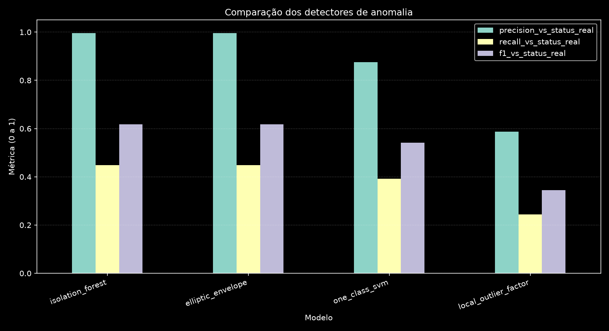
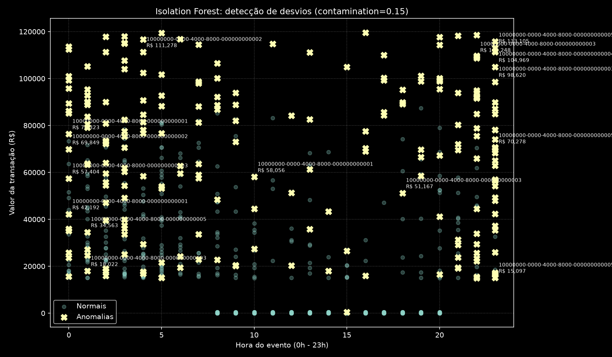
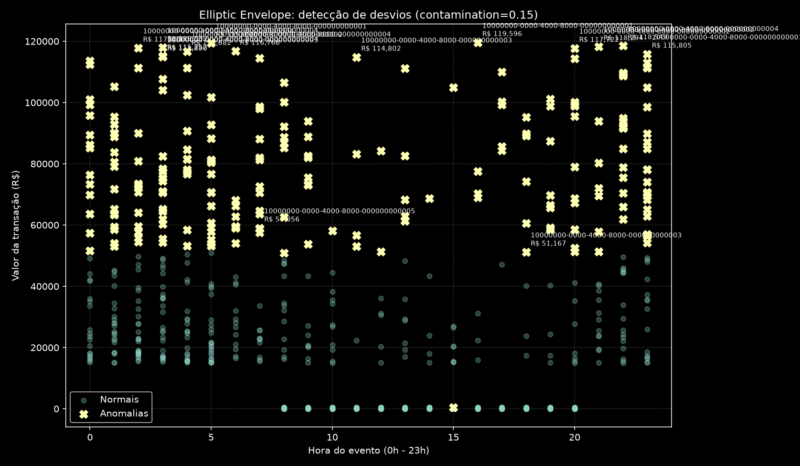
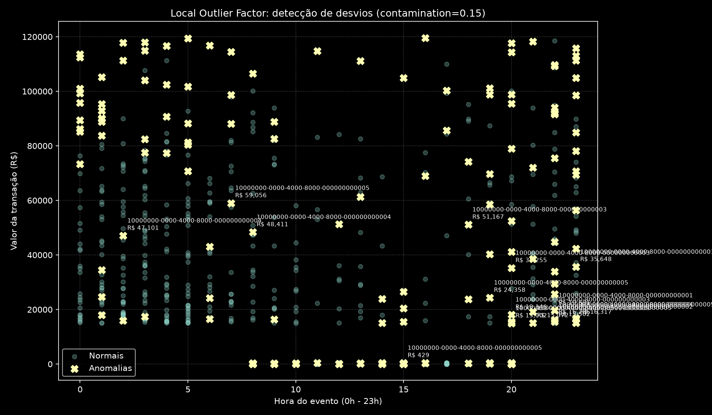
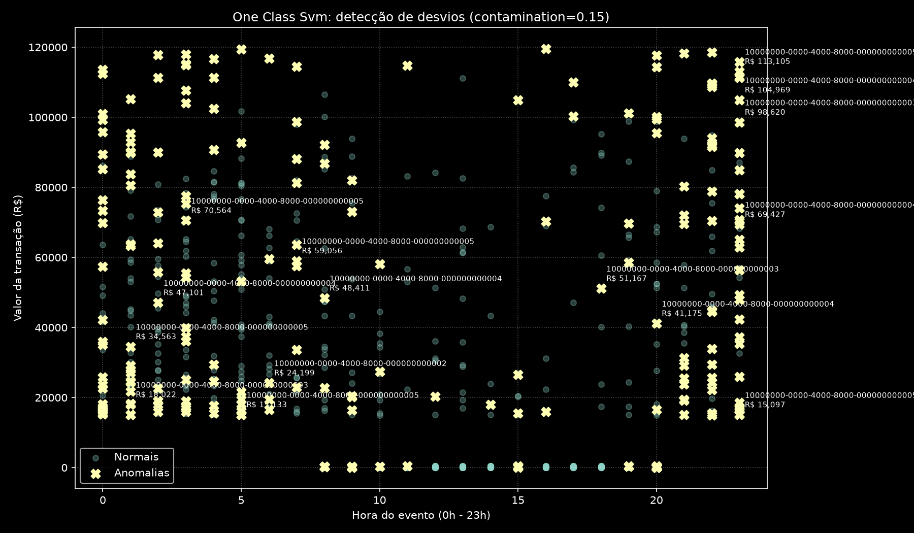
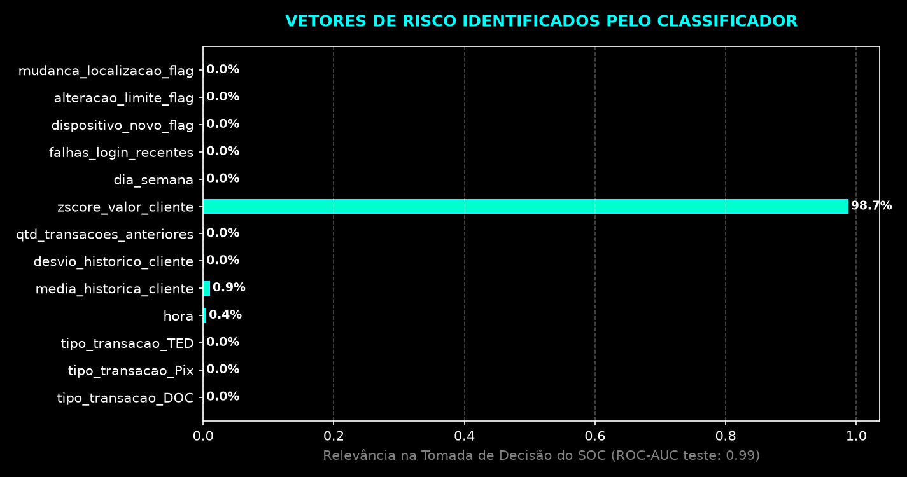

# 🛡️ SOC Transaction Anomaly Detector

Projeto de detecção de anomalias em transações financeiras orientado a apoio de investigação em SOC, desenvolvido a partir do Bootcamp **Bradesco - GenAI, Dados & Cyber**.

A versão `v2.0.0` amplia a prova de conceito original com uma arquitetura modular, controles de segurança em PostgreSQL/Supabase, automação de testes e qualidade, persistência de alertas, integração com MITRE ATT&CK e práticas de DevSecOps.

O sistema combina Python, PostgreSQL, Machine Learning e Segurança Cibernética para analisar comportamento transacional, correlacionar sinais de segurança, comparar detectores e produzir artefatos técnicos para apoio à triagem e investigação.

## 📌 Objetivo

O objetivo do projeto é construir um pipeline capaz de:

- carregar transações a partir de PostgreSQL/Supabase;
- validar, limpar e preparar os dados;
- criar features comportamentais;
- executar classificação supervisionada para triagem;
- executar detectores não supervisionados de anomalia;
- comparar resultados e selecionar automaticamente o detector mais adequado segundo critérios definidos no pipeline;
- estimar severidade de risco;
- correlacionar sinais com MITRE ATT&CK;
- gerar alertas SOC estruturados;
- persistir alertas opcionalmente em JSONL ou SQLite;
- registrar auditoria de acesso ao dataset operacional;
- gerar gráficos, métricas, CSV, JSON e relatório PDF;
- executar verificações automatizadas de qualidade e segurança por meio do pipeline DevSecOps.

O projeto permanece uma **prova de conceito baseada em dados sintéticos** e não deve ser interpretado como sistema de detecção de fraude pronto para produção.

## 🧪 Natureza dos dados

A base utilizada neste projeto é composta por **dados sintéticos**, criados exclusivamente para fins educacionais e experimentais.

O banco foi populado com:

- transações consideradas normais;
- transações classificadas como suspeitas;
- eventos de autenticação;
- falhas recentes de login;
- uso de dispositivo novo;
- alterações de limite;
- mudanças de localização.

Nos modelos não supervisionados, o status da transação não participa do treinamento. Ele é utilizado apenas posteriormente para auditoria e comparação dos resultados.

---

## 🏗️ Arquitetura

```text
PostgreSQL / Supabase
        │
        ▼
View operacional de investigação do SOC
        │
        ▼
Validação e preparação dos dados
        │
        ▼
Engenharia de features
        │
        ├── Classificador supervisionado de triagem
        ├── Detectores não supervisionados / novelty detection
        └── Regressão de severidade
                │
                ▼
Comparação de métricas
                │
                ▼
Seleção automática do melhor detector
                │
                ├──────────────────────┐
                ▼                      ▼
       Correlação MITRE ATT&CK    Geração de alertas SOC
                │                      │
                │                Persistência opcional
                │                  JSONL / SQLite
                │                      │
                └───────────┬──────────┘
                            ▼
                  Gráficos, métricas,
                  JSON, CSV e PDF
```
---
A arquitetura de banco aplica separação de responsabilidades entre o runtime do SOC, a ingestão de Threat Intelligence e os componentes de auditoria.

O runtime utiliza uma view operacional minimizada e uma identidade PostgreSQL dedicada, enquanto a ingestão do MITRE ATT&CK utiliza uma credencial independente com permissões específicas. Essa separação reduz a exposição de dados e aplica o princípio de menor privilégio.

---

## 📂 Estrutura do repositório

```text
.
├── .github/
│   ├── dependabot.yml
│   └── workflows/
│       └── ci.yml
│
├── src/
│   ├── alerts/
│   │   ├── bootstrap.py
│   │   ├── config.py
│   │   ├── contract.py
│   │   ├── engine.py
│   │   ├── factory.py
│   │   ├── jsonl_repository.py
│   │   ├── query.py
│   │   ├── repository.py
│   │   ├── serialization.py
│   │   ├── sqlite_query.py
│   │   └── sqlite_repository.py
│   │
│   ├── data/
│   │   ├── columns.py
│   │   ├── repository.py
│   │   └── validation.py
│   │
│   ├── features/
│   │   └── engineering.py
│   │
│   ├── models/
│   │   ├── anomaly_detection.py
│   │   ├── classification.py
│   │   ├── evaluation.py
│   │   └── regression.py
│   │
│   ├── reporting/
│   │   ├── charts.py
│   │   ├── metrics.py
│   │   └── pdf_report.py
│   │
│   ├── threat_intel/
│   │   └── mitre.py
│   │
│   ├── db_connector.py
│   ├── ingest_mitre.py
│   └── security_detector.py
│
├── database/
│   ├── queries/
│   │   └── forensic_investigation.sql
│   ├── schema/
│   │   ├── 00_extensions.sql
│   │   ├── 01_schema.sql
│   │   ├── 02_threat_intelligence.sql
│   │   ├── 03_audit.sql
│   │   ├── 04_soc_view.sql
│   │   └── 05_security.sql
│   └── seeds/
│       ├── 01_base_entities.sql
│       ├── exemplo_popular_normal_banco.sql
│       └── exemplo_popular_anomalia_banco.sql
│
├── docs/
│   ├── architecture/
│   │   ├── ml-models.md
│   │   ├── overview.md
│   │   └── pipeline.md
│   └── devsecops/
│       ├── ci-pipeline.md
│       ├── container-security.md
│       ├── overview.md
│       ├── security-controls.md
│       └── supply-chain.md
│
├── reports/
│   └── resultado_multimodelo/
│
├── tests/
│   ├── integration/
│   └── unit/
│
├── .dockerignore
├── .env.example
├── .gitattributes
├── .gitignore
├── CHANGELOG.md
├── Dockerfile
├── README.md
├── pyproject.toml
├── requirements.txt
├── uv.lock
└── LICENSE
```
---
A estrutura reflete a modularização introduzida na v2.0.0, separando responsabilidades de dados, Machine Learning, Threat Intelligence, geração e persistência de alertas, reporting, segurança e testes.

---

## 🔎 Engenharia de features

O pipeline utiliza atributos originais e derivados do comportamento histórico dos clientes:

- valor da transação;
- horário do evento;
- dia da semana;
- média histórica por cliente;
- desvio-padrão histórico;
- Z-Score do valor da transação;
- quantidade de transações anteriores;
- falhas recentes de login;
- uso de dispositivo novo;
- alteração de limite;
- mudança de localização;
- tipo da transação.

O Z-Score mede quanto o valor atual se afasta do comportamento histórico do cliente.

---

## 🤖 Modelos implementados

### Classificador supervisionado

Foi utilizado um `DecisionTreeClassifier` para reproduzir decisões históricas de triagem.

O objetivo desse classificador não é descobrir ataques inéditos, mas avaliar quais features mais contribuíram para a classificação das transações já rotuladas.

### Detectores não supervisionados

Foram comparados quatro modelos:

| Modelo | Característica principal |
|---|---|
| Isolation Forest | Isola observações incomuns por particionamento aleatório |
| Local Outlier Factor | Identifica desvios em relação à densidade local |
| One-Class SVM | Aprende uma fronteira para representar o comportamento normal |
| Elliptic Envelope | Modela a distribuição dos dados por uma região elíptica robusta |

### Regressão de severidade

Foi utilizada uma regressão linear para estimar um score de risco entre 0 e 100.

Essa parte é experimental e deverá ser reavaliada com uma base maior e modelos mais adequados para níveis ordinais de risco.

---

## 📊 Resultados experimentais

Os detectores utilizaram o mesmo conjunto de features e foram avaliados com o mesmo conjunto de dados.

| Modelo | Anomalias | Precision | Recall | F1-score | ROC-AUC | Tempo |
|---|---:|---:|---:|---:|---:|---:|
| Elliptic Envelope | 225 | **0,996** | **0,448** | **0,618** | **0,9992** | 0,096 s |
| Isolation Forest | 225 | **0,996** | **0,448** | **0,618** | 0,9989 | 0,234 s |
| One-Class SVM | 224 | 0,875 | 0,392 | 0,541 | 0,7431 | **0,040 s** |
| Local Outlier Factor | 208 | 0,587 | 0,244 | 0,345 | 0,5938 | 0,047 s |

### Modelo selecionado

O modelo selecionado automaticamente foi:

> **Elliptic Envelope**

O critério utilizado foi:

1. maior F1-score;
2. maior recall;
3. maior precision;
4. menor tempo de execução.

O Elliptic Envelope apresentou F1-score, recall e precision equivalentes aos do Isolation Forest no conjunto sintético utilizado. Como esses critérios permaneceram empatados, a seleção automática foi definida pelo menor tempo de execução.

---

## 📑 Documentação

- 📄 [Relatório Executivo SOC (PDF)](reports/resultado_multimodelo/Relatorio_Incidente_SOC.pdf)
  
---
## 📈 Comparação visual



---

## 🌲 Isolation Forest



---

## 📐 Elliptic Envelope



---

## 🧭 Local Outlier Factor



---

## 🧠 One-Class SVM



---

## 🔬 Importância das features

O classificador de triagem atingiu ROC-AUC próximo de `0,99`.



A feature `zscore_valor_cliente` concentrou aproximadamente 98,7% da importância do classificador na execução final da v2.0.0.

Esse resultado indica que, no conjunto sintético utilizado, a separação entre transações normais e suspeitas está fortemente associada ao desvio do valor da transação em relação ao histórico do cliente.

Embora o desempenho seja positivo para a prova de conceito, essa concentração também representa uma limitação experimental: o classificador apresenta forte dependência de uma única variável, o que reduz a diversidade dos sinais utilizados na decisão.

---

## 🛡️ Segurança e privacidade

A v2.0.0 aplica controles de segurança em diferentes camadas do projeto:

- conexão SSL obrigatória com PostgreSQL/Supabase;
- credenciais mantidas fora do código por meio de variáveis de ambiente;
- separação de identidades PostgreSQL por responsabilidade;
- princípio de menor privilégio;
- Row Level Security (RLS);
- revogação de privilégios padrão desnecessários;
- view operacional minimizada para o runtime do SOC;
- pseudonimização persistente dos clientes;
- auditoria de acessos ao dataset;
- separação entre runtime do SOC, ingestão MITRE ATT&CK e auditoria;
- consultas forenses privilegiadas isoladas do fluxo operacional;
- minimização da exposição de dados nos relatórios;
- secret scanning, análise estática, auditoria de dependências e scan de container no pipeline de CI/CD.

Os dados utilizados são sintéticos e não representam clientes, contas ou operações reais.

---

## 🎯 MITRE ATT&CK

O pipeline utiliza dados do MITRE ATT&CK armazenados no PostgreSQL.

A correlação considera sinais como:

- múltiplas falhas de login;
- dispositivo novo;
- alteração de limite;
- mudança de localização;
- possível comprometimento de conta.

O mapeamento é utilizado como apoio à investigação e não representa confirmação automática de ataque.

---

## ⚙️ Como executar

### 1. Clonar o repositório

```bash
git clone https://github.com/KUMA-LAB-1/soc-transaction-anomaly-detector.git
cd soc-transaction-anomaly-detector
```

### 2. Preparar o ambiente Python

A versão 2.0.0 utiliza Python 3.12.

#### Opção recomendada: `uv`

Com o `uv` instalado:

```bash
uv sync
```

Esse comando cria ou sincroniza o ambiente virtual do projeto a partir de `pyproject.toml` e `uv.lock`, preservando as versões resolvidas para a v2.0.0.

Para executar comandos dentro desse ambiente, utilize:

```bash
uv run <comando>
```

#### Alternativa: `venv` + `pip`

No Windows:

```bash
python -m venv .venv
.venv\Scripts\activate
pip install -r requirements.txt
```

No Linux ou macOS:

```bash
python3 -m venv .venv
source .venv/bin/activate
pip install -r requirements.txt
```

O arquivo `requirements.txt` permanece disponível como alternativa simplificada para instalação das dependências de runtime.

### 3. Configurar as variáveis de ambiente

Copie `.env.example` para um arquivo `.env` na raiz do projeto.

Depois configure as credenciais de banco de acordo com a responsabilidade de cada componente:

- `SOC_DATABASE_URL`: conexão utilizada pelo runtime principal do pipeline SOC, associada a uma identidade PostgreSQL com a capability `soc_pipeline`;
- `MITRE_DATABASE_URL`: conexão utilizada exclusivamente pela rotina de ingestão do MITRE ATT&CK, associada a uma identidade PostgreSQL com a capability `threat_intel_writer`;
- `SOC_PIPELINE_USER`: identidade lógica registrada nos eventos de auditoria do pipeline.

Essa separação aplica o princípio de menor privilégio, evitando que o pipeline operacional e a rotina de ingestão de inteligência de ameaças compartilhem uma credencial de banco com permissões excessivas.

Além das credenciais de banco, a persistência de alertas pode ser configurada por meio de:

- `ALERT_STORAGE`: backend de persistência dos alertas;
- `ALERT_JSONL_PATH`: caminho utilizado para persistência em JSONL;
- demais opções de armazenamento documentadas no `.env.example`.

Por padrão, `ALERT_STORAGE=none`, permitindo executar o pipeline sem persistir alertas localmente.

> O arquivo `.env` não deve ser versionado. Utilize `.env.example` apenas como referência de configuração.

### 4. Preparar o banco

Execute os scripts de `database/schema/` nesta ordem:

```text
00_extensions.sql
01_schema.sql
02_threat_intelligence.sql
03_audit.sql
04_soc_view.sql
05_security.sql
```

Depois carregue os dados sintéticos em `database/seeds/`, começando por:

```text
01_base_entities.sql
```

Em seguida, execute os seeds de transações normais e anômalas.

As consultas disponíveis em:

```text
database/queries/forensic_investigation.sql
```

são destinadas a investigação forense manual e privilegiada e não fazem parte do fluxo normal de inicialização do banco.

### 5. Importar o MITRE ATT&CK

Com `uv`:

```bash
uv run python src/ingest_mitre.py
```

Ou, com o ambiente virtual já ativado:

```bash
python src/ingest_mitre.py
```

### 6. Executar o detector

Com `uv`:

```bash
uv run python -m src.security_detector
```

Ou, com o ambiente virtual já ativado:

```bash
python -m src.security_detector
```

Os artefatos de execução são gerados em `reports/`.

O snapshot público utilizado na documentação e no README é mantido em `reports/resultado_multimodelo/`.

---

## 📄 Relatório

O pipeline gera automaticamente um relatório contendo:

- resumo executivo;
- transações sinalizadas;
- pseudônimos dos clientes;
- score de risco;
- probabilidade de suspeita;
- comparação dos modelos;
- métricas de validação;
- correlação com MITRE ATT&CK.

Arquivo gerado:

```text
reports/resultado_multimodelo/Relatorio_Incidente_SOC.pdf
```

---

## ⚠️ Limitações

Este projeto é uma prova de conceito baseada em dados sintéticos.

As principais limitações são:

- as anomalias foram simuladas;
- a base ainda não representa toda a diversidade de fraudes reais;
- os resultados não podem ser generalizados para ambiente produtivo;
- o parâmetro `contamination=0.15` influencia a quantidade de alertas;
- o classificador apresentou forte dependência do Z-Score;
- a regressão de severidade necessita de validação adicional;
- não foi realizada validação temporal;
- não há monitoramento de data drift ou concept drift.

---

## 🧾 Conclusão

A comparação mostrou que o Elliptic Envelope apresentou o melhor equilíbrio entre precision e recall na base sintética utilizada.

O Isolation Forest também apresentou bom desempenho e demonstrou maior flexibilidade para distribuições menos restritivas.

O resultado do Elliptic Envelope deve ser interpretado dentro do cenário experimental, pois esse modelo pressupõe que os dados normais possam ser representados por uma distribuição aproximadamente elíptica.

Por isso, a seleção atual representa o melhor resultado para esta base, não uma conclusão universal sobre detecção de fraudes.

---

## 🗺️ Roadmap

### ✅ v1.0.0 — Análise de Dados e Segurança

- preparação dos dados;
- engenharia de features;
- comparação entre detectores;
- geração de métricas e gráficos;
- PostgreSQL;
- relatório PDF;
- MITRE ATT&CK;
- pseudonimização e auditoria.

### ✅ v2.0.0 — DevSecOps

- testes automatizados;
- análise estática;
- auditoria de dependências;
- Docker;
- GitHub Actions;
- scan de segurança;
- pipeline CI/CD;
- hardening do PostgreSQL/Supabase com RLS e least privilege;
- separação de identidades e permissões por responsabilidade.

### 🔮 v3.0.0 — Projeto final

- API REST;
- dashboard;
- autenticação;
- monitoramento;
- deploy.

---

## 👨‍💻 Autor

**Wellington Hikaru Kumagai**

Projeto desenvolvido durante o Bootcamp Bradesco - GenAI, Dados & Cyber.
